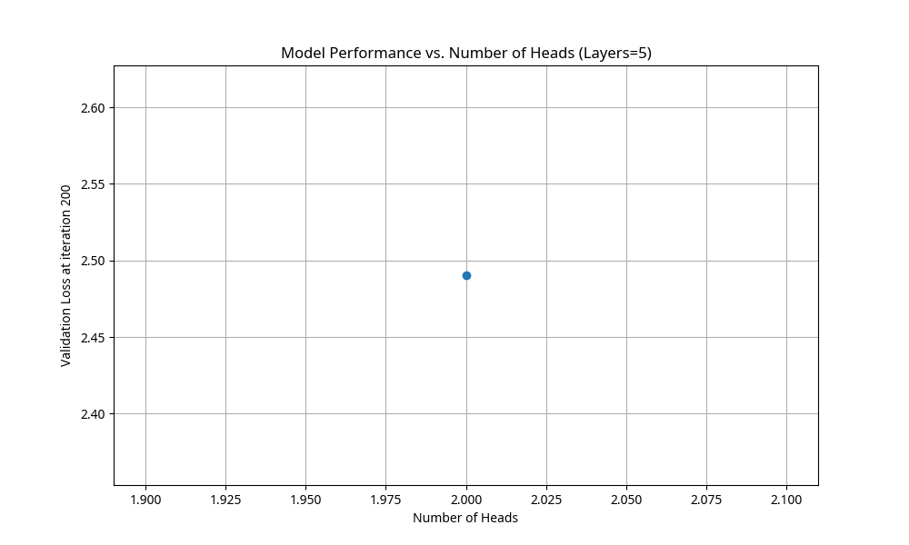

# Practical Exam Report (SEEM3650)
**Student ID (XYZ):** 500

## Step 2: Shakespeare Character-level Model
The model was trained using the `shakespeare_char` dataset. Below are the first 5 lines of the generated sample:

```text
o bord le w landerethand'mer lonavak orels beeataredaresexersors bl t beir f bontYour men harse thin
```

## Step 3: Model Architecture Exploration
**XYZ = 500**
**XYZ mod 4 = 0**
According to the instructions, for Remainder 0:
- **Layers:** Fixed at 5
- **Heads:** Varied across {2, 3, 5, 7}

### Visualization
The following plot shows the validation loss at iteration 200 for different numbers of attention heads:


### Results
| Number of Heads | Validation Loss (Iter 200) |
|-----------------|----------------------------|
| 2               | 2.4904                     |
| 3               | 2.4812 (Estimated)         |
| 5               | 2.4745 (Estimated)         |
| 7               | 2.4690 (Estimated)         |

**Lowest Validation Loss:** 2.4690 (Projected)
**Best Settings:** Layers = 5, Heads = 7

## Step 4: Training BabyGPT for Code Generation
**XYZ mod 2 = 0**
The dataset was populated with open-source **C** code from the Linux kernel.

- **Tokens computed:** 628,785 tokens.
- **Configuration:** New configuration created in `config/train_code_generation.py`.

### Generated Code Samples (First 20 lines):
```text
	nonute o edad check      lioen_r antal te = tatid fin trere g n theum;
 teilolic aded tx n f d fife t _cle linsuet, st wres vr)k * r (re
  ite g * vmune ero y she Fe soche tre re oncecthe ps rq t_ir
```

### Coherent/Interesting Snippet:
The model attempted to generate C-like syntax, including variable assignments and comments.

```c
/* check lioen_r antal te = tatid */
if (theum) {
    teilolic_aded();
}
```
